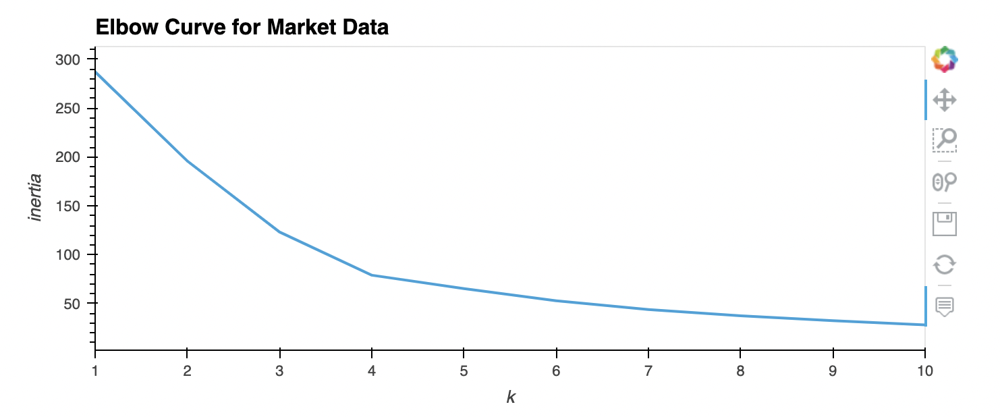
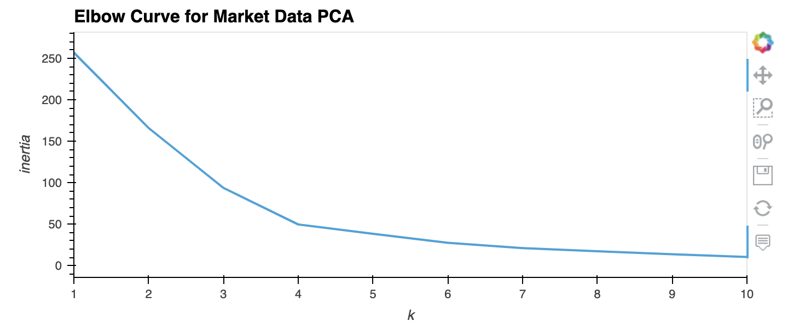
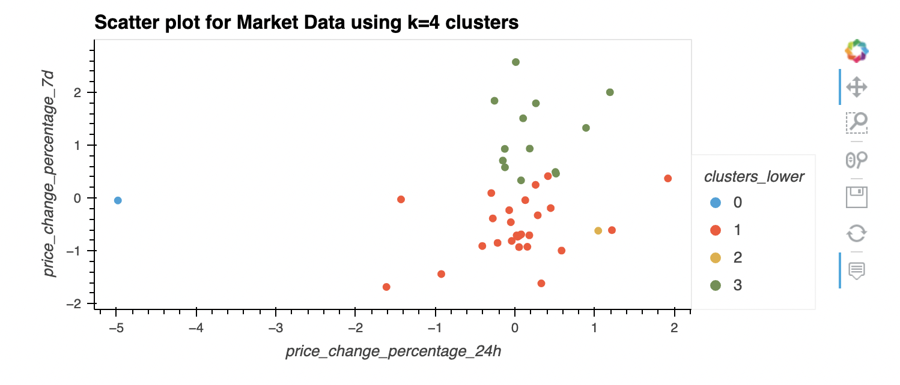
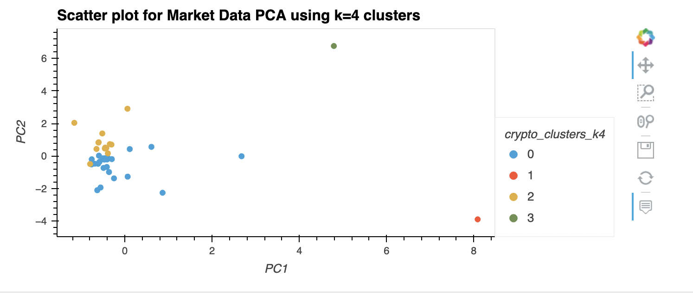

## crypto_investments

The **crypto_investments** uses unsupervised machine learning to determine best value of crypto cluster segments to inlcude in the portfolio. 

## Technologies

This project leverages python 3.7.13 with the following packages:

* [pandas](https://pandas.pydata.org/) - For data analysis
* [scikit-learn](https://scikit-learn.org/stable/) - For Machine Learning
* [hvplot](https://hvplot.holoviz.org/index.html) - For data exploration and visualization
---

## Installation Guide

Before running the application first install the pandas dependency in conda dev environment.

```python

    conda create -n dev python=3.7 anaconda

    python -m ipykernel install --user --name dev

    conda activate dev

    conda install pandas
    pip install -U scikit-learn
    conda install -c pyviz hvplot

    conda deactivate 
  
```

---


## Usage

To use the **crypto_investments** simply clone the repository and run the **crypto_investments.ipynb** with jupyter lab:

```python
    conda activate dev

    jupyter lab

    conda deactivate 
```

Plots of crypto investments analysis to determine best value of crypto clusters segments













---

## Contributors

Kausar Hina

---

## License

MIT

